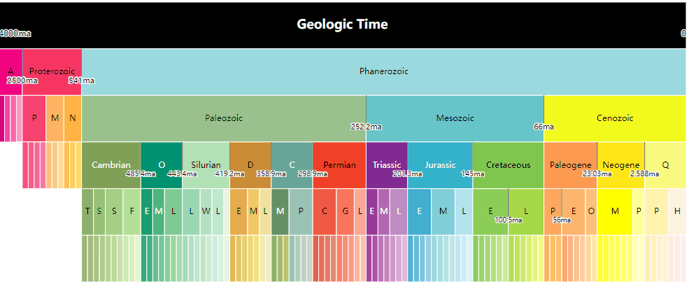

# geo-timeline

A D3.js(v7) based geologic timeline&timeScale

[](https://unpkg.com/@zjugis/geo-timeline)  


- ``Zoom:`` Use the mouse wheel to control zoom, double-click to zoom in.
- ``Adjustment:`` Hold down the left button to drag the timeline.
- ``Location:`` Left click the timeline to move the handler quickly, or drag to move the handler.


- ``Location:`` Left click the geo stage to quick location.
- ``Zoom:`` Use the mouse wheel to control zoom in or zoom out.

## Install

For node.js

```bash
#npm
npm install --save @zjugis/geo-timeline
#yarn
yarn add @zjugis/geo-timeline
```

For legacy environments, you can load @zjugis/geo-timeline’s UMD bundle from an npm-based CDN such as jsDelivr; a `timeLine` global is exported:

```html
<script src="https://cdn.jsdelivr.net/npm/d3@7"></script>
<script src="//unpkg.com/@zjugis/geo-timeline@latest"></script>

<script>
  fetch('./test/GTS_2020.json').then(async res => {
    const intervals = await res.json()

    new timeLine.GeoTimeLine("#geoTimeLineContainer", intervals)
    new timeLine.GeoTimeScale("#geoTimeScaleContainer", intervals)
  })
</script>
```

### Usage

For node.js

```ts
import { GeoTimeLine, GeoTimeScale } from "@zjugis/geo-timeline";

fetch('./test/GTS_2020.json').then(async res => {
  const intervals = await res.json()

  // create geotimeline obj
  const geoTimeLine = new GeoTimeLine("#geoTimeContainer", intervals, {
    onChange: function(time, level) {
      // do something
    },
    // determin interval by time
    intervalSum: d => d.leaf ? d.start - d.end : 0
  });

  // It is recommended to set the time after changing the level
  geoTimeLine.level = 2
  geoTimeLine.time = 2000

  // create geotimescale obj
  const geoTimeScale = new GeoTimeScale("#geoTimeScale-simple", intervals, {
    onChange: val => console.log(val),
    // only show 2 levels once
    simplify: true,
    height: 70,
  })
  // set stage
  geoTimeScale.stage = 'Cambrian'
})

```

### API

#### GeoTimeLine

```ts
class GeoTimeLine {
    /** text font */
    readonly font: string;
    /** interval data's max level */
    readonly maxLevel: number;
    /** svg object */
    readonly svg: Selection<SVGSVGElement, unknown, HTMLElement, any>;
    /** interval data */
    readonly intervals: IntervalItem[];
    /** hierarchical data generated by intervals */
    readonly hierarchicalData: HierarchyNode<IntervalItem>;
    /** the root hierarchical data */
    readonly root: NodeItem;
    /** user input options */
    readonly options: GeoTimeLineOptions
    
    /** 
     * Create a GeoTimeLine
     * @param selector CSS selector string
     * @param intervals geo time intervals array
     * @param options GeoTimeLine options
    */
    constructor(selector: string | BaseType, intervals: IntervalItem[], options?: GeoTimeLineOptions);

    /** get or set time */
    get time(): number;
    set time(val: number);
    /** get or set level */
    get level(): number;
    set level(val: number);
    get ready(): boolean;
}

/**
 * BaseType serves as an alias for the 'minimal' data type which can be selected
 * without 'd3-selection' trying to use properties internally which would otherwise not
 * be supported.
 */
type BaseType = Element | EnterElement | Document | Window | null;

interface GeoTimeLineOptions {
    /** geo time intervals array */
    intervals: IntervalItem[];
    /** svg width, defaults to container's width */
    width?: number;
    /** svg height, defaults to 70 */
    height?: number;
    /** font size, defaults to 16px */
    fontSize?: number;
    /** font family, defaults to 'sans-serif' */
    fontFamily?: string;
    /** callback when handle's position or scale level changed */
    onChange?: (time: number, level: number) => void;
    /** dispatch when mouseup or zoom  */
    onAfterChange?: (time: number, level: number) => void;
    /** defaults to {
      top: 0, right: 0, bottom: 0, left: 0,
    } */
    margin?: {
        top?: number;
        bottom?: number;
        left?: number;
        right?: number;
    }
    /** defaults to {
      top: 0, right: 0, bottom: 0, left: 0,
    } */
    padding?: {
        top?: number;
        bottom?: number;
        left?: number;
        right?: number;
    }
    /** initial time, defaults to 0 */
    time?: number;
    /** animation time, defaults to 450ms */
    transition?: number;
    /** interval transform setting, defaults to (d) => d.leaf ? 1 : 0 */
    intervalSum?: (d: IntervalItem) => number;
    /** min zoom level */
    minZoom?: number;
    /** max zoom level, defaults to 10 */
    maxZoom?: number;
}

/** geo time data intervals schema **/
type IntervalItem = {
    id: number;
    name: string;
    abbr?: string;
    color: string;
    textColor?: string;
    end: number;
    start: number;
    level?: number;
    parentId?: number;
    leaf?: boolean;
}

```

#### GeoTimeScale

```ts
class GeoTimeLine {
    /** text font */
    readonly font: string;
    /** svg object */
    readonly svg: Selection<SVGSVGElement, unknown, HTMLElement, any>;
    /** interval data */
    readonly intervals: IntervalItem[];
    /** hierarchical data generated by intervals */
    readonly hierarchicalData: HierarchyNode<IntervalItem>;
    /** the root hierarchical data */
    readonly root: NodeItem;
    /** user input options */
    readonly options: GeoTimeScaleOptions;
    
    /**
     * Create a GeoTimeScale
     * @param selector CSS selector string
     * @param intervals geo time intervals array
     * @param options GeoTimeScale options
     */
    constructor(selector: string | BaseType, intervals: IntervalItem[], options?: GeoTimeScaleOptions);
    /** get or set animation transition time */
    transition: number;
    /** get or set focused stage
     * @example
     * geoTimeScale.stage = 'Cambrian'
     */
    get stage(): string;
    set stage(val: string);
    get sequence(): NodeItem[];
    get ready(): boolean;
}

interface GeoTimeScaleOptions {
    /** geo time intervals array */
    intervals: IntervalItem[];
    /** svg width, defaults to container's width */
    width?: number;
    /** svg height, defaults to 400px */
    height?: number;
    /** font size, defaults to 12px */
    fontSize?: number;
    /** font family, defaults to 'sans-serif' */
    fontFamily?: string;
    /** callback when handle's position or scale level changed */
    onChange?: (node: NodeItem) => void;
    /** defaults to {
      top: 0, right: 0, bottom: 0, left: 0,
    } */
    margin?: MarginOpts;
    /** defaults to {
      top: 0, right: 0, bottom: 0, left: 0,
    } */
    padding?: MarginOpts;
    /** animation time, defaults to 450ms */
    transition?: number;
    /** interval transform setting, defaults to d => d.leaf ? d.start - d.end : 0 */
    intervalSum?: (d: IntervalItem) => number;
    /** show all levels or not, defaults to false */
    simplify?: boolean;
    /** focused node's neighbor node width, defaults to 100px */
    neighborWidth?: number;
    /** tick length, defaults to 15px */
    tickLength?: number;
}
```

## Custom data

The [interval](./test/GTS_2020.json) item's schema like follow:

```json
{
  "id": 753,
  "name": "Archean",
  "level": 1,
  "parentId": 0,
  "color": "#F0047F",
  "end": 2500,
  "start": 4000
}
```

## Demo

[Online demo](https://geo-timeline.vercel.app/)

geoTimeLine


geoTimeScale


## Develop

Run the command:

```bash
pnpm dev
```

And then Launch [index.html](index.html) with node server, if use VS Code, suggest the ``Live Server`` extension.

Run test:

```bash
pnpm test
```

## Credit

<https://github.com/UW-Macrostrat/geo-timescale>
